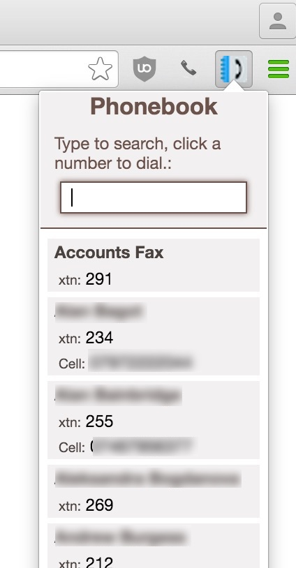

# phonebookDialer

Show, search and dial extensions on a local Asterisk system.
Allows quick and easy access to a range of numbers, click any entry to make a call to that destination.

Will find:
* Extensions on the system
* Additional numbers assigned to those extension users, as added in User Manager (FreePBX)
* Ring Groups
* 'Personal Directory'. Each user creates a contacts group in UCP Contact Manager, with their extension number for the group name, and those entries will be added too.
* 'reverse-search' works too, search part of a number, all matches are shown.
* Type a number into the search field and hit enter/return to place a call to that number.

**New:** Add right-click dialing. Highlight a number on a web page to dial it. 

## Installation

Download or clone the repo, add the phonebookDialer folder to chrome as an unpacked extension in the extension settings page.

The extension runs client-side, of course, so the actual dialing is performed by a small script server side. That file is phonebookDialer.php in the repo, and should be stored on the Asterisk server in an accessible location (*/var/www/html* perhaps)

The extension will ask for this location and your extension number on first use.

## configuration

~~The dialing script location is editable in the options interface, the default value is held in *options.js* line 23. Set this to the correct value before use to make things easy.~~
The server-side dialer is set in line 5 of phonebook.js and is no longer configurable by the user, there's really no point making the user type this in, it's always going to be the same.

Edit the configuration options in the phonebookDialer.php file to suit your environment.

## dialing script

The script connects using the AGI connection provided by FreePBX, to use this without FreePBX will require a change to the dial code.

The same script is responsible for reading the list of extension numbers, it is designed for FreePBX so it leverages that platform for the database connection.

## screenshot

